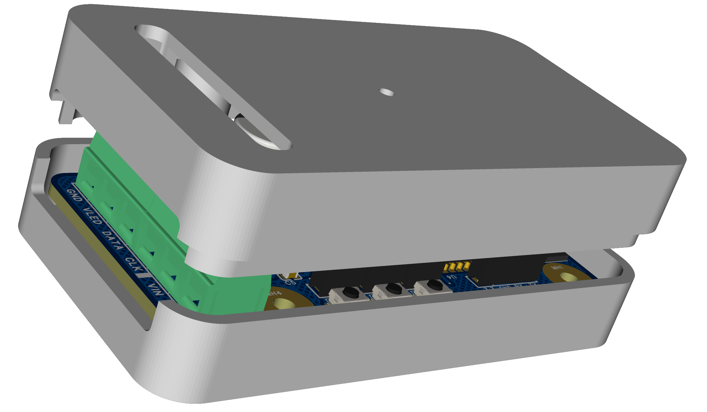
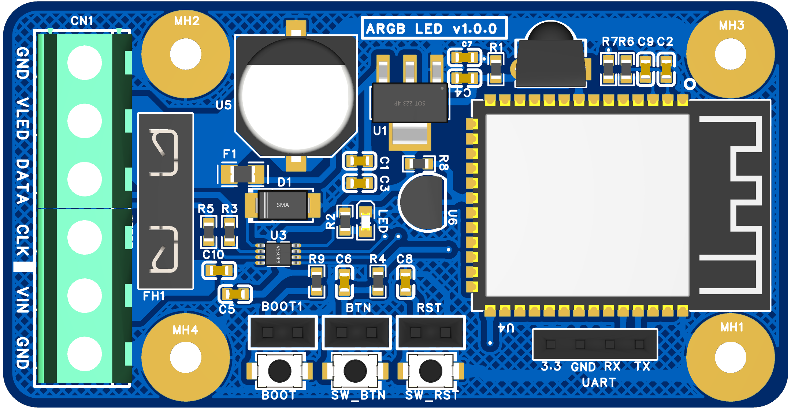
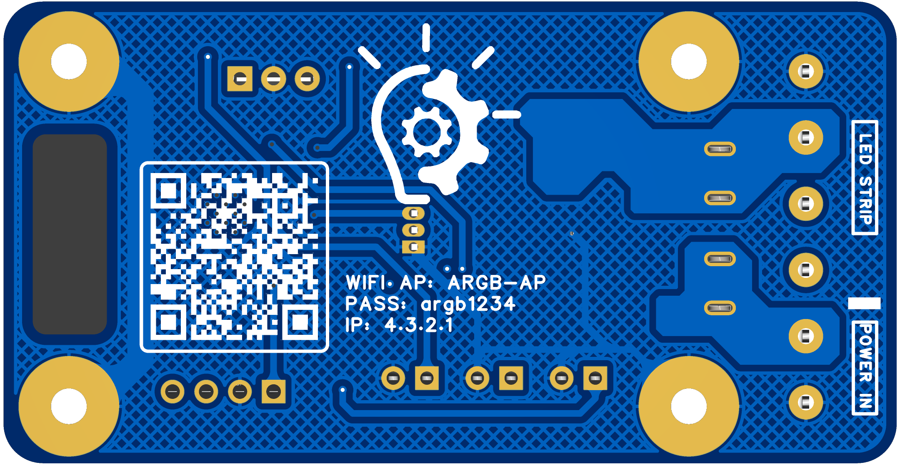
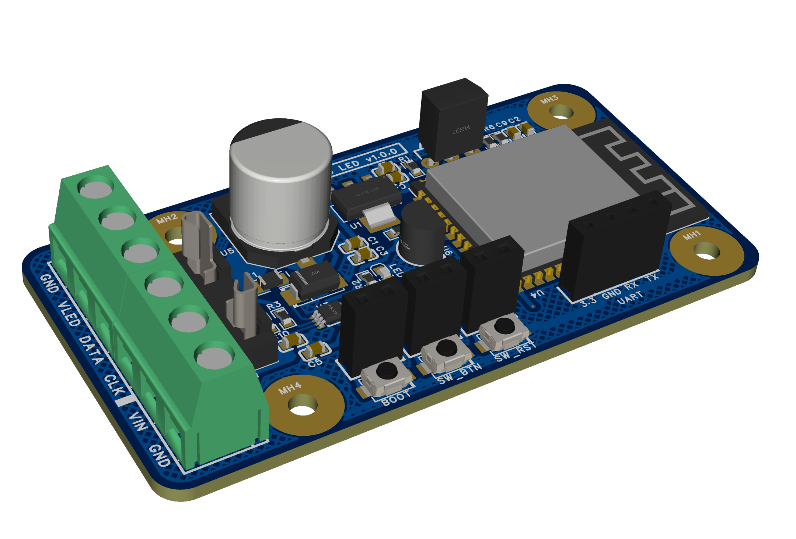
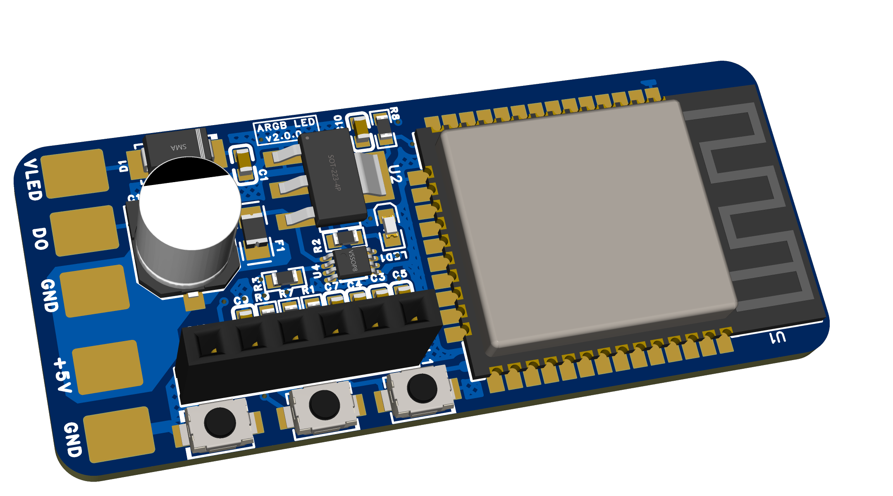

## Chào mừng đến với bộ điều khiển PIXEL ARGB HSL! ✨

- [Basics - Bắt đầu cơ bản](basics/getting-started)

- [Features - Effects - Hiệu ứng](features/effects) 

- [Features - Palettes - Bảng màu](features/palettes) 

- [Một số video hướng dẫn](basics/tutorials)

### 💡Bộ Điều Khiển LED ARGB HSL Thông Minh – Đỉnh Cao Công Nghệ LED WiFi 

#### ⚡**Điều Khiển LED Pixel Dễ Dàng qua Điện Thoại và PC**
- **Hỗ trợ ứng dụng điện thoại, PC/Laptop:** Điều khiển LED Pixel ARGB với giao diện trực quan và trải nghiệm người dùng mượt mà.  
- **Kết nối WiFi 2.4GHz mạnh mẽ:** Tận hưởng khả năng đồng bộ liền mạch giữa các thiết bị mà không bị giới hạn số lượng mạch kết nối.  

#### ⚡**Đồng Bộ Hiệu Ứng Đỉnh Cao – Hoàn Hảo Cho Các Ứng Dụng Ánh Sáng**
- **Chế độ Master-Client thông minh:** Một mạch Master ARGB HSL có thể đồng bộ hóa chế độ và hiệu ứng ánh sáng cho tất cả các mạch Client trong cùng mạng WiFi.  
- **Mở rộng không giới hạn:** Ghép nối linh hoạt giữa nhiều mạch ARGB HSL, cho phép mở rộng hệ thống LED lên đến hàng chục nghìn bóng. Ví dụ: Đạo cụ sử dụng 16.000 LED có thể được phân bổ qua 2 mạch, mỗi mạch hỗ trợ tối đa 8.000 LED.  

#### ⚡**Tương Thích Với Hệ Thống Điều Khiển Chuyên Nghiệp**
- **Tích hợp các bộ trình điều khiển phổ biến:** Hoạt động mượt mà với các nền tảng như Falcon Player (FPP), Xlight, Jinx!, LEDFX, hỗ trợ hiệu ứng ánh sáng sân khấu chuyên nghiệp.  
- **Tốc độ phản hồi nhanh:** Đáp ứng tức thì mọi lệnh điều khiển qua mạng WiFi 2.4GHz, đảm bảo độ trễ tối thiểu.  

#### ⚡**Ứng Dụng Linh Hoạt**
- Phù hợp cho trình diễn ánh sáng nghệ thuật, trang trí sự kiện, LED sân khấu, hoặc các dự án DIY đòi hỏi hiệu ứng ánh sáng độc đáo.  

💡 **Giải pháp LED thông minh ARGB HSL** – Nâng tầm trải nghiệm ánh sáng của bạn!

**Triển khai nhanh chóng** và nhiều tính năng để điều khiển đèn **LED NeoPixel** (WS2812B, WS2811, SK6812, ...) hoặc các chipsets dựa trên SPI như WS2801 và APA102!

#### Bộ điều khiển V1.0.0

- Với nhiều ngoại vi đi kèm **IR hồng ngoại**, cảm biến nhiệt, **cầu chì bảo vệ** dây LED...

- Mạch có 2 ngõ ra led độc lập 3 chân (hoặc 1 ngõ ra led 4 chân)

<link rel="stylesheet" href="assets/js/styles.css">

   

      
   

   

      
   

   

      
   

   

      
   

#### Bộ điều khiển V2.0.0

- Với kích thước làm điểm mạnh, siêu nhỏ gọn **22mm x 52mm**

<link rel="stylesheet" href="assets/js/styles.css">

   

      
   

   

      
   

   

      
   

<!-- Modal to display full-size image -->

   &times;
   

### 💡 Các loại chip Led được hổ trợ

**Triển khai nhanh chóng** và nhiều tính năng để điều khiển đèn **LED NeoPixel** (WS2812B, WS2811, SK6812, ...) hoặc các chipsets dựa trên SPI như WS2801 và APA102!

- ⚡👉 [Các loại PIXEL LED mà ARGB HSL tích hợp ](basics/compatible-led-strips)

#### ⚙️ Tính năng

- Thư viện **WS2812FX** tích hợp cho **hơn 180 hiệu ứng đặc biệt**
- Hiệu ứng **FastLED** và 50 bảng màu
- Giao diện hiện đại với điều khiển màu sắc, hiệu ứng và **phân đoạn Led**
- **Phân đoạn** để đặt các hiệu ứng và màu sắc khác nhau **cho các phần của đèn LED**
- Két nối mạng wifi thông minh.
- Tối đa **8 ngõ đầu ra kết nối đèn LED** cho mỗi mạch **ARGB HSL** (**mỗi đầu ra 800 - 1000 leds**)
- Có thể kết nối không giới hạn các module **ARGB HSL**
- **Tối đa 250 Preset** của người dùng để dễ dàng lưu và tải màu sắc/hiệu ứng, hỗ trợ chuyển đổi qua lại giữa chúng
- **Preset** có thể được sử dụng để tự động thực thi các lệnh API
- Chức năng đèn ngủ (giảm dần độ sáng)
- Cập nhật phần mềm OTA đầy đủ, có thể bảo vệ bằng mật khẩu.
- Đồng hồ analog có thể cấu hình + **hỗ trợ bộ kit Cronixie của Diamex**
- **Giới hạn độ sáng tự động** có thể cấu hình để **hoạt động an toàn** hơn.
- Cấu hình dựa trên hệ thống tập tin để **dễ dàng sao lưu cài đặt** trước và cài đặt.

<!-- - Native [Home-Assistant integration](https://www.home-assistant.io/integrations/wled/):  -->

### 💡 Ứng dụng điều khiển mạch

#### ⚡Phần mềm bắt buộc:

- 💻Trên PC/laptop:
   - 🔥 [WIFI LED PC – LED Control](https://github.com/w00000dy/WLED-GUI/releases/): Công cụ **điều khiển chính**

- 📱Trên Smartphone:
   - 🔥 Ứng dụng **Android**: [WIFI LED](https://play.google.com/store/apps/details?id=ca.cgagnier.wlednativeandroid)
   - 🔥 Ứng dụng **iOS**: [WIFI LED](https://apps.apple.com/us/app/wled-native/id6446207239)

#### ⚡Phần mềm tùy chọn trên PC/laptop:
- 🔥 [xLights – LED Control](https://xlights.org/releases/): Điều khiển và lập trình LED chuyên nghiệp.
- 🔥 [Jinx! – LED Matrix Control](https://live-leds.de/): Điều khiển LED cho bảng ma trận chuyên dụng.
- 🔥 [LedFx](https://www.ledfx.app/): Điều khiển LED nhấp nháy theo nhạc sống động.
- 🔥 [Lightpack - Prismatik](https://github.com/psieg/Lightpack/releases): Hiệu ứng **Ambilight** trang trí màn hình PC/laptop.
- 🔥 [Hyperion](https://github.com/hyperion-project/hyperion.ng): Trang trí LED cho TV với hiệu ứng đẹp mắt.

#### ⚡👉 [Danh sách các phần mềm khác](basics/compatible-software).

### 💡 Các chuẩn kết nối ARGB có thể sử dụng

- [JSON](interfaces/json-api) and [HTTP request](interfaces/http-api) APIs  
- [MQTT](interfaces/mqtt)  
<!-- - [Blynk IoT](interfaces/blynk)   -->
- [E1.31](interfaces/e1.31-dmx), [Art-Net](interfaces/e1.31-dmx), DDP and [TPM2.net](interfaces/udp-realtime)
- [UDP realtime](interfaces/udp-realtime)
- [Alexa voice control (including dimming and color)](/advanced/remote-access-ifttt)
- [Sync to Philips Hue lights](interfaces/philips-hue)
- Adalight (PC ambilight via serial) và TPM2 -> Trang trí màn hình PC/Laptop siêu đẹp
- [Sync color of multiple ARGB devices (UDP notifier)](interfaces/udp-notifier)
- [Infrared remotes (24-key RGB, receiver required)](interfaces/infrared)
- Simple timers/schedules (time from NTP, timezones/DST supported)  

## ✌️ Happy Smart Light

### 💡 Cập nhật chương trình từ bo mạch

- HSL sẳn sàng hỗ trợ cập nhật phần mềm từ xa cho các mạch của HSL mỗi khi ra bản cập nhật mới!

